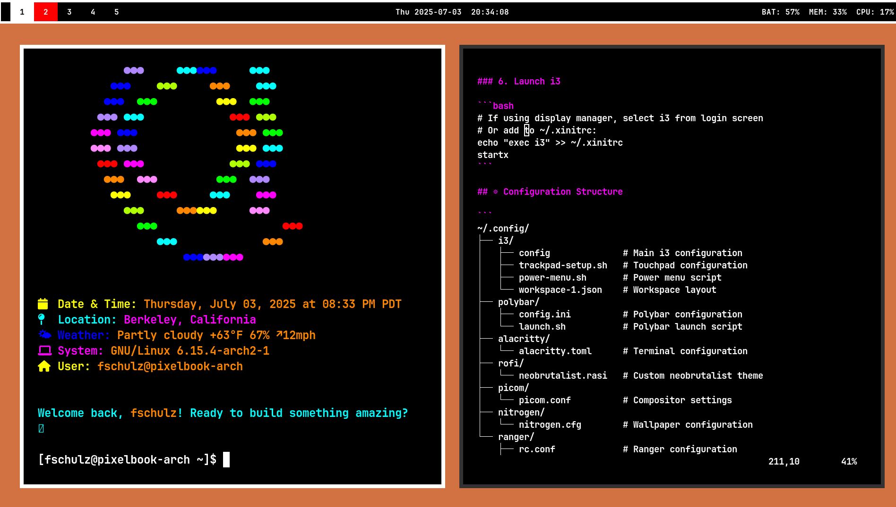
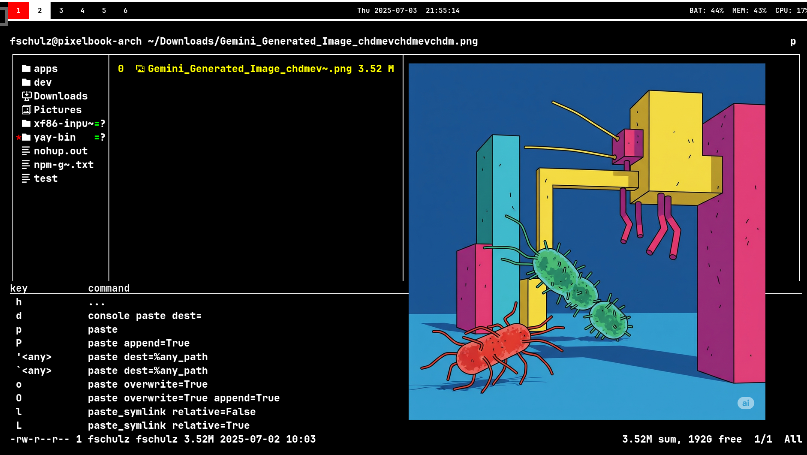
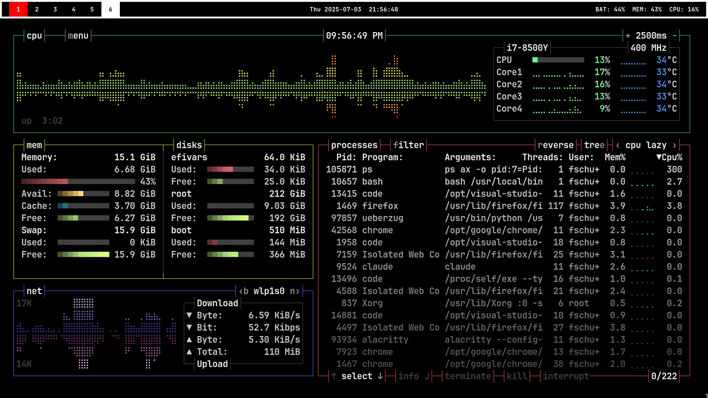

# 🏗️ i3 Neobrutalist Configuration

> A stark, minimalist configuration for i3 window manager featuring bold borders, high contrast, and geometric simplicity.


## 📸 Screenshots

### Desktop Overview

*Complete neobrutalist i3 setup with terminal greeting, polybar, and themed applications*

### Ranger File Manager with Image Preview

*Ranger file manager displaying image previews using ueberzug with neobrutalist theme*

### System Monitor (btop)

*btop system monitor showing CPU, memory, and process information with clean interface*

## 🎨 Design Philosophy

This configuration embraces **neobrutalist design principles**:
- **Bold, thick borders** (5px) with stark white focus indicators
- **High contrast** black and white color scheme
- **Geometric layouts** with generous gaps (20px inner, 10px outer)
- **Minimal visual noise** - no shadows, no gradients, just raw functionality
- **Typography-first** using JetBrains Mono Bold throughout

## 🚀 Quick Start

```bash
# Clone the repository
git clone https://github.com/your-username/i3-neobrutalist-config.git
cd i3-neobrutalist-config

# Run the automated setup script (coming soon)
# ./install.sh

# Or manually copy configurations
cp -r .config/* ~/.config/
```

## 📦 Dependencies

### Core Components

| Component | Package | Purpose |
|-----------|---------|---------|
| **Window Manager** | `i3-gaps` (v4.22+) | Tiling window manager with gaps support |
| **Status Bar** | `polybar` | Customizable status bar |
| **Terminal** | `alacritty` | GPU-accelerated terminal emulator |
| **Launcher** | `rofi` | Application launcher with custom theme |
| **Compositor** | `picom` | Window compositor (optional) |

### Required Software

```bash
# Core packages (required)
sudo pacman -S i3-gaps polybar alacritty rofi picom nitrogen \
               ttf-jetbrains-mono otf-font-awesome dunst \
               network-manager-applet blueman xorg-xsetroot \
               redshift pulseaudio pavucontrol playerctl light \
               maim xclip ranger ueberzug

# Recommended packages (enhanced experience)
sudo pacman -S zathura zathura-pdf-poppler highlight w3m glow \
               lightdm lightdm-webkit2-greeter openssh github-cli \
               firefox code docker docker-compose npm

# Power management (laptops)
sudo pacman -S tlp tlp-rdw powertop

# Python development
sudo pacman -S uv
# pixi needs to be installed from AUR or their installer

# Documentation
sudo pacman -S quarto

# Additional tools from AUR
yay -S libinput-gestures pixi-bin
```

### Package Installation Notes

⚠️ **Important Considerations:**

1. **Claude Code**: Install via their official method, not through pacman
2. **Visual Studio Code**: Use `code` (OSS build) or download the official binary
3. **Google Chrome**: Install from AUR:
   ```bash
   yay -S google-chrome
   ```
4. **Docker**: Remember to add your user to the docker group:
   ```bash
   sudo usermod -aG docker $USER
   ```
5. **TLP**: For laptops only. Disable if using a desktop. May conflict with other power managers.
6. **LightDM**: Optional - only if you want a graphical login screen

<details>
<summary>📋 Complete Package List</summary>

#### Display & Graphics
- `nitrogen` - Wallpaper manager
- `picom` - Compositor (for transparency/shadows)
- `xorg-xsetroot` - Set root window properties
- `maim` - Screenshot utility
- `lightdm` - Display manager for graphical login
- `lightdm-webkit2-greeter` - Modern themed greeter for LightDM

#### System Integration
- `dunst` - Notification daemon
- `network-manager-applet` - Network manager tray icon
- `blueman` - Bluetooth manager
- `libinput-gestures` - Touchpad gesture support
- `redshift` - Blue light filter

#### Audio
- `pulseaudio` / `pipewire-pulse` - Audio server
- `pavucontrol` - Volume control GUI
- `playerctl` - Media player control

#### Utilities
- `light` - Backlight control
- `xclip` - Clipboard utilities
- `ranger` - Terminal file manager
- `highlight` - Source code syntax highlighting for ranger preview
- `w3m` - Terminal web browser for ranger image preview
- `btop` - Resource monitor (auto-starts on workspace 5)
- `pacman-contrib` - Tools for pacman (includes paccache for cache cleaning)

#### Document Viewers
- `zathura` - Minimalist PDF/document viewer
- `zathura-pdf-poppler` - PDF support for zathura

#### Development Tools
- `code` - Visual Studio Code (OSS build)
- `github-cli` - GitHub's official command line tool
- `openssh` - SSH client and server
- `docker` - Container platform
- `docker-compose` - Multi-container Docker applications
- `npm` - Node.js package manager
- `glow` - Terminal markdown renderer

#### Power Management
- `tlp` - Advanced power management
- `tlp-rdw` - Radio device wizard for TLP
- `powertop` - Power consumption analyzer

#### Python Package Managers
- `uv` - Extremely fast Python package installer
- `pixi` - Package management for reproducible environments

#### Documentation Tools
- `quarto` - Scientific and technical publishing system

#### Fonts
- `ttf-jetbrains-mono` - Primary monospace font
- `otf-font-awesome` - Icon font for status bar

</details>

## 🏗️ Installation Guide

### 1. Prerequisites

Ensure you have a working Arch Linux installation with:
- X11 display server
- Basic development tools (`base-devel`)
- Git

### 2. Install Dependencies

```bash
# Update system
sudo pacman -Syu

# Install all required packages
sudo pacman -S i3-gaps polybar alacritty rofi ttf-jetbrains-mono \
               otf-font-awesome dunst network-manager-applet blueman \
               picom nitrogen xorg-xsetroot libinput-gestures redshift \
               pulseaudio pavucontrol playerctl light maim xclip ranger
```

### 3. Clone Configuration

```bash
# Create config directory if it doesn't exist
mkdir -p ~/.config

# Clone this repository
git clone https://github.com/your-username/i3-neobrutalist-config.git
cd i3-neobrutalist-config
```

### 4. Deploy Configuration Files

```bash
# Copy all configuration files
cp -r src/.config/* ~/.config/
cp src/.bashrc ~/.bashrc

# Make scripts executable
chmod +x ~/.config/i3/*.sh
chmod +x ~/.config/polybar/*.sh
```

### 5. Configure Display

```bash
# Set wallpaper with nitrogen
nitrogen --set-scaled /path/to/your/wallpaper.jpg

# Or use solid color background (already configured)
# The config sets a brutalist orange (#d27242) background
```

### 6. Launch i3

```bash
# If using display manager, select i3 from login screen
# Or add to ~/.xinitrc:
echo "exec i3" >> ~/.xinitrc
startx
```

## ⚙️ Configuration Structure

```
├── images/                     # Screenshots and documentation images
│   ├── screenshot-1751600045.png  # Desktop overview
│   ├── screenshot-1751604912.png  # Ranger file manager
│   └── screenshot-1751605006.png  # System monitor
├── src/
│   ├── .bashrc                 # Enhanced bash configuration
│   └── .config/
│       ├── i3/
│       │   ├── config              # Main i3 configuration
│       │   ├── trackpad-setup.sh   # Touchpad configuration
│       │   ├── power-menu.sh       # Power menu script
│       │   └── workspace-1.json    # Workspace layout
│       ├── polybar/
│       │   ├── config.ini          # Polybar configuration
│       │   └── launch.sh           # Polybar launch script
│       ├── alacritty/
│       │   └── alacritty.toml      # Terminal configuration
│       ├── rofi/
│       │   └── neobrutalist.rasi   # Custom neobrutalist theme
│       ├── picom/
│       │   └── picom.conf          # Compositor settings
│       ├── nitrogen/
│       │   └── nitrogen.cfg        # Wallpaper configuration
│       └── ranger/
│           ├── rc.conf             # Ranger configuration
│           ├── scope.sh            # Preview script
│           └── colorschemes/
│               └── neobrutalist.py # Custom neobrutalist theme
└── README.md                   # This file
```

## 🎨 Customization

### Color Scheme

The neobrutalist theme uses a minimal palette defined in multiple locations:

| Element | Color | Hex |
|---------|-------|-----|
| **Background** | Black | `#000000` |
| **Foreground** | White | `#FFFFFF` |
| **Accent** | Blue-Gray | `#2a687a` |
| **Warning** | Yellow | `#f9b409` |
| **Urgent** | Red | `#FF0000` |
| **Root BG** | Brutalist Orange | `#d27242` |

### Modifying Colors

1. **i3 colors**: Edit `~/.config/i3/config` (lines 10-15)
2. **Polybar colors**: Edit `~/.config/polybar/config.ini` (lines 1-5)
3. **Terminal colors**: Edit `~/.config/alacritty/alacritty.toml` (lines 12-25)
4. **Rofi theme**: Edit `~/.config/rofi/neobrutalist.rasi`

### Gaps and Borders

```bash
# In ~/.config/i3/config
gaps inner 20    # Space between windows
gaps outer 10    # Space from screen edges
default_border pixel 5    # Border width
```

## ⌨️ Key Bindings

### Essential Shortcuts

| Key Combination | Action |
|-----------------|--------|
| `Mod + Return` | Open terminal (Alacritty) |
| `Mod + d` | Launch Rofi |
| `Mod + Shift + q` | Close window |
| `Mod + Shift + r` | Reload i3 config |
| `Mod + Shift + e` | Exit i3 |

### Window Management

| Key Combination | Action |
|-----------------|--------|
| `Mod + h/j/k/l` | Focus left/down/up/right |
| `Mod + Shift + h/j/k/l` | Move window |
| `Mod + f` | Fullscreen toggle |
| `Mod + v` | Split vertical |
| `Mod + h` | Split horizontal |

### Workspace Navigation

| Key Combination | Action |
|-----------------|--------|
| `Mod + 1-9` | Switch to workspace |
| `Mod + Shift + 1-9` | Move window to workspace |

**Default Workspace Applications:**
- Workspace 1: Two terminal windows
- Workspace 2: Firefox
- Workspace 3: VS Code
- Workspace 4: btop (system monitor)
- Workspace 5: Google Chrome
- Workspace 6: Ranger file manager

### Special Features

| Key Combination | Action |
|-----------------|--------|
| `Mod + Shift + f` | Open Ranger file manager |
| `Print` | Take screenshot |
| `Mod + g` | Increase gaps |
| `Mod + Shift + g` | Decrease gaps |

## 🔧 Troubleshooting

### Common Issues

<details>
<summary>Polybar not showing</summary>

```bash
# Check polybar logs
tail -f /tmp/polybar.log

# Restart polybar manually
~/.config/polybar/launch.sh
```
</details>

<details>
<summary>Touchpad not working properly</summary>

```bash
# Run touchpad setup manually
~/.config/i3/trackpad-setup.sh

# Check xinput devices
xinput list
```
</details>

<details>
<summary>Fonts not displaying correctly</summary>

```bash
# Rebuild font cache
fc-cache -fv

# Verify fonts are installed
fc-list | grep -i "jetbrains"
fc-list | grep -i "awesome"
```
</details>

### Performance Optimization

The configuration includes performance optimizations:
- Picom is disabled by default (uncomment in i3 config to enable)
- Smart gaps and borders reduce rendering overhead
- Minimal polybar modules

## 📝 Additional Setup

### Ranger File Manager

Ranger comes with a custom neobrutalist colorscheme that matches the overall aesthetic:

**Features:**
- Stark black/white color scheme with bold highlights
- Thick borders around columns (`draw_borders both`)
- Selected items have inverted colors (white background, black text)
- Directory names in bold white
- Executable files in bold green
- Media files in yellow/cyan
- Git integration with color-coded status

**Key Bindings:**
- `gd` - Go to Documents
- `gD` - Go to Downloads  
- `gc` - Go to .config
- `<backspace>` - Toggle hidden files
- `ee` - Edit in vim
- `ec` - Edit in VS Code
- `ez` - Open in zathura

The ranger configuration includes:
- Custom neobrutalist colorscheme
- Enhanced preview script with syntax highlighting
- Image previews using ueberzug
- Archive previews
- PDF text previews
- Video thumbnails

### Zathura Configuration

Zathura fits perfectly with the neobrutalist aesthetic. Create `~/.config/zathura/zathurarc`:
```bash
# Neobrutalist theme for zathura
set default-bg "#000000"
set default-fg "#ffffff"

set statusbar-bg "#000000"
set statusbar-fg "#ffffff"

set inputbar-bg "#000000"
set inputbar-fg "#ffffff"

set recolor-lightcolor "#000000"
set recolor-darkcolor "#ffffff"
```

### Power Management (Laptops)

```bash
# Enable TLP for battery optimization
sudo systemctl enable tlp.service
sudo systemctl start tlp.service

# Check TLP status
sudo tlp-stat
```

### Docker Setup

```bash
# Add user to docker group
sudo usermod -aG docker $USER

# Enable docker service
sudo systemctl enable docker.service
sudo systemctl start docker.service

# Log out and back in for group changes to take effect
```

### Automated System Updates

This configuration includes an optional automated update system using systemd timers:

```bash
# During installation, you'll be prompted to set up automated updates
# Or run manually:
cd ~/.config/i3/
./setup-auto-update.sh
```

Features:
- Weekly updates every Sunday at 3:00 AM (randomized by up to 1 hour)
- Automatic package cache cleaning (keeps last 2 versions)
- Update logs stored in `/var/log/arch-updates.log`
- Systemd journal integration

To manage automated updates:
```bash
# Check timer status
sudo systemctl status arch-update.timer

# View next scheduled run
sudo systemctl list-timers arch-update.timer

# View update logs
sudo journalctl -u arch-update.service

# Disable automated updates
sudo systemctl disable arch-update.timer
```

### Bluetooth Audio

```bash
# Install bluetooth audio support
sudo pacman -S pulseaudio-bluetooth

# Restart pulseaudio
pulseaudio -k
pulseaudio --start
```

### Display Scaling

For HiDPI displays, add to `~/.Xresources`:
```
Xft.dpi: 144
```

### Multi-Monitor

Polybar automatically detects monitors. For manual configuration:
```bash
# List connected monitors
xrandr

# Edit polybar config
# Set monitor = HDMI-1 or appropriate output
```

## 🚧 Roadmap

- [ ] Automated installation script
- [ ] GTK/Qt theme integration
- [ ] Power management profiles
- [ ] Workspace-specific layouts
- [ ] Screenshot/recording utilities integration
- [ ] Dotfile management system

## 📄 License

This configuration is provided as-is under the MIT License. Feel free to modify and distribute.

## 🤝 Contributing

Contributions are welcome! Please:
1. Fork the repository
2. Create a feature branch
3. Commit your changes
4. Push to the branch
5. Open a Pull Request

---

<div align="center">
Built with ❤️ for the brutalist aesthetic
</div>